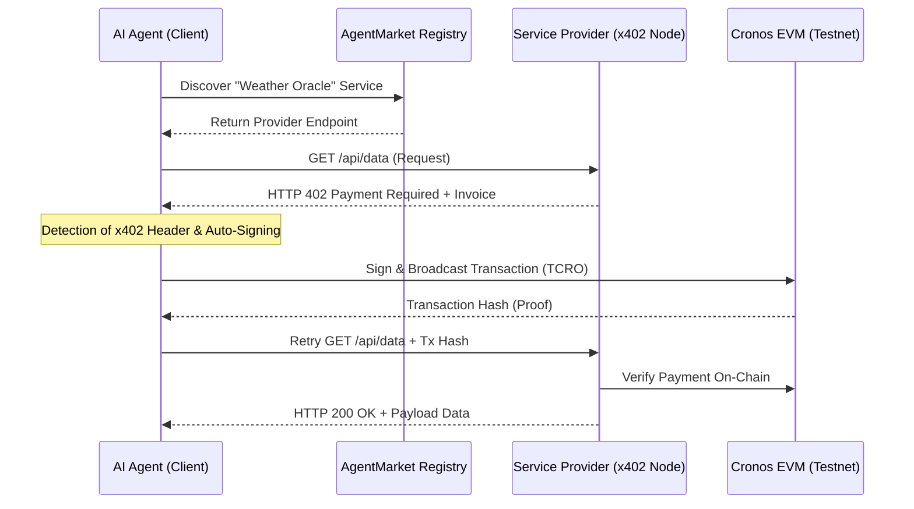

# AgentMarket 🤖⚡
### The Financial Operating System for the Machine Economy on Cronos


**Live Demo:**
(https://agentflow-402.vercel.app/)  
**Demo Video:**  (https://youtu.be/ckvuhVjpvF4)

**AgentMarket** is a decentralized service registry and settlement layer that enables autonomous AI Agents to discover APIs, negotiate pricing, and settle transactions on-chain without human intervention. Built on **Cronos EVM**, we utilize the **HTTP 402 (Payment Required)** protocol to power the next generation of machine-to-machine (M2M) commerce.

---

## 💡 The Vision
AI Agents are currently "unbanked." They can generate code and analyze data, but they cannot pass a KYC check or swipe a credit card to purchase a simple API key. **AgentMarket** provides the financial operating system for these agents, allowing them to pay for resources programmatically, atomically, and autonomously.

## 🛠 Technical Architecture

AgentMarket acts as a specialized middleware between AI Agents (Buyers) and Service Providers (Sellers). Our implementation focuses on a zero-friction "402 Handshake" that any LLM can understand.

### The x402 Agentic Payment Flow

## 🚀 Why We Stand Out (Key Features)
​Live Economic Activity Ticker: A real-time feed showcasing a bustling agentic economy with live M2M transactions.

​Atomic x402 Settlement: Instant, per-request payments that eliminate the need for expensive monthly subscriptions.

​Agent-First Service Registry: A structured marketplace designed for machine discovery, not just human browsing.

​Proof of Settlement: Every transaction generates a cryptographic receipt (Modal), providing agents with verifiable proof of purchase (hash, gas used, block time).

​⚙️ Tech Stack
​Frontend: Next.js 14 (App Router), Tailwind CSS
​Blockchain: Cronos Testnet (Chain ID: 338)
​Web3 Integration: Viem / Wagmi for programmatic signing
​Real-time Data: Supabase (Powering the live activity ticker)
​Protocol: x402 (Payment Required) standard

​📦 Project Structure
```
├── src/
│   ├── components/       # UI Components (Live Ticker, Receipt Modal)
│   ├── hooks/            # Custom Web3 hooks for x402 logic
│   ├── lib/              # Blockchain & Supabase configurations
│   └── pages/            # Service Registry & x402 Demo Console
├── contracts/            # Mock Payment Registry & Logic
└── public/               # Assets & Icons
```
How to Run Locally

🏗️ Clone the repository:
```
git clone [https://github.com/Xzavior34/agent-market.git](https://github.com/Xzavior34/agent-market.git)
```
Install dependencies:
```
npm install
```
Run the development server:
```
npm run dev
```
Built for the Cronos x402 PayTech Hackathon 2026
